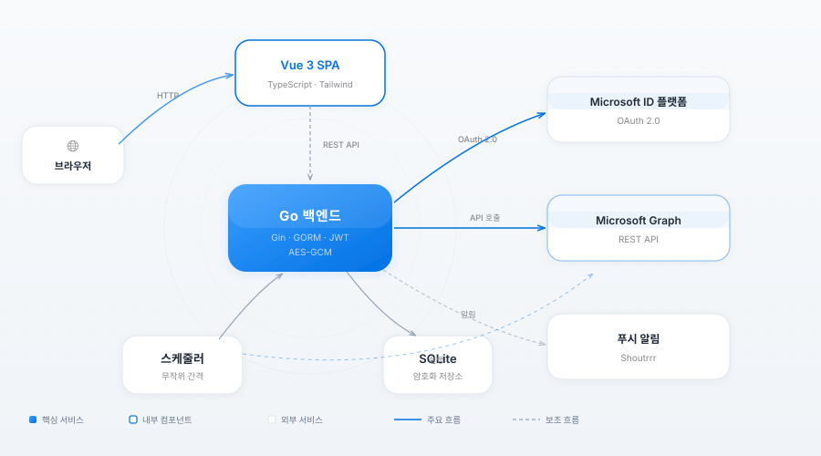

<p align="center">
  
</p>
<h1 align="center">E5 Renewal</h1>
<p align="center">
  무작위 Graph API 호출을 예약해 Microsoft 365 E5 개발자 구독을 활성 상태로 유지하는 셀프 호스팅 자동 갱신 도구입니다.
</p>

구독 만료일은 Microsoft Graph의 `/v1.0/directory/subscriptions` 엔드포인트에서 매일 동기화됩니다. `Organization.Read.All` 권한을 부여하세요. 클라이언트 자격 증명에는 관리자 동의를 받은 애플리케이션 권한이 필요하고, 인증 코드 계정에는 위임 권한과 지원되는 디렉터리 역할이 필요합니다. 표시되는 날짜는 Graph의 다음 수명 주기 전환일이며, 갱신 상태의 최종 기준은 Microsoft 365 Developer Program 대시보드입니다.

<p align="center">
  <a href="https://github.com/cnzakii/e5-renewal/blob/main/LICENSE"></a>
  <a href="https://github.com/cnzakii/e5-renewal"></a>
  <a href="https://github.com/cnzakii/e5-renewal/releases"></a>
  <a href="https://github.com/cnzakii/e5-renewal/actions"></a>
  <a href="https://github.com/cnzakii/e5-renewal/commits"></a>
</p>

<p align="center">
  <a href="README.md">기본 한국어 문서</a>
</p>

---

## 주요 기능

- **자동 스케줄링** — 실제 사용과 비슷한 시간 분포를 적용한, 설정 가능한 무작위 간격의 Graph API 호출
- **다중 계정 관리** — 여러 E5 계정에 독립적인 스케줄 적용
- **OAuth 2.0** — 토큰을 간편하게 설정할 수 있는 내장 인증 코드 흐름
- **상태 모니터링** — 계정별 상태 점수를 계산하고 실패율이 임계값을 넘으면 자동 일시 중지
- **푸시 알림** — 인증 만료, 작업 실패, 상태 점수 저하를 [Shoutrrr](https://containrrr.dev/shoutrrr/)로 알림
- **대시보드** — 추세 차트와 실행 로그를 포함한 시각적 개요
- **다국어 UI** — 중국어와 영어 인터페이스 지원
- **경량 배포** — 프런트엔드를 Go 바이너리에 내장한 단일 Docker 이미지(약 30MB), 실행 메모리 약 27MB

## 화면 미리 보기

<p align="center">
  
</p>
<p align="center">
  
</p>

## 아키텍처

<p align="center">
  
</p>

## 빠른 시작

### 사전 준비

먼저 Azure 애플리케이션을 등록해야 합니다. 자세한 절차는 [이 가이드](https://ednovas.xyz/2022/01/10/e5renewplus/#1-%E6%B3%A8%E5%86%8CAzure%E5%BA%94%E7%94%A8%E7%A8%8B%E5%BA%8F)를 참고하세요.

### Docker

```bash
docker run -d \
  --name e5-renewal \
  -p 8080:8080 \
  -v ./data:/data \
  -e E5_JWT_SECRET=$(openssl rand -hex 32) \
  -e E5_ENCRYPTION_KEY=$(openssl rand -hex 16) \
  ghcr.io/cnzakii/e5-renewal:latest
```

처음 시작하면 로그인 키가 자동으로 생성되어 로그에 출력됩니다.

```bash
docker logs e5-renewal
# 다음 내용을 찾으세요: login key generated  key=xxxxxxxx-xxxx-xxxx-xxxx-xxxxxxxxxxxx
```

## 설정

환경 변수 또는 YAML 설정 파일을 사용할 수 있으며, 환경 변수가 우선 적용됩니다.

설정 파일은 `E5_CONFIG` 환경 변수 → 작업 디렉터리의 `config.yaml` / `config.yml` / `config.json` 순서로 탐색합니다. 템플릿은 [`e5-renewal.yaml.example`](e5-renewal.yaml.example)을 참고하세요.

| 변수 | 필수 | 기본값 | 설명 |
|----------|----------|---------|-------------|
| `E5_CONFIG` | 아니요 | 자동 감지 | 설정 파일 경로(예: `/data/config.yaml`) |
| `E5_JWT_SECRET` | 예 | — | JWT 서명 비밀 키(무작위 64자리 16진수 문자열 권장) |
| `E5_ENCRYPTION_KEY` | 예 | — | 저장된 민감 정보를 암호화할 AES 키(설정 후 변경 불가) |
| `E5_LOGIN_KEY` | 아니요 | 자동 생성 | 관리자 로그인 비밀번호 |
| `E5_DB_PATH` | 아니요 | `data/e5.db` | SQLite 데이터베이스 파일 경로 |
| `E5_PATH_PREFIX` | 아니요 | — | URL 경로 접두사(예: `/myapp`) |
| `E5_PORT` | 아니요 | `8080` | 수신 대기 포트 |
| `E5_TLS_CERT` | 아니요 | — | TLS 인증서 파일 경로 |
| `E5_TLS_KEY` | 아니요 | — | TLS 개인 키 파일 경로 |

## Docker Compose

```yaml
services:
  e5-renewal:
    image: ghcr.io/cnzakii/e5-renewal:latest
    restart: unless-stopped
    ports:
      - "8080:8080"
    volumes:
      - ./data:/data
    env_file:
      - .env
```

## 개발

**필수 환경:** Go 1.25 이상, Node.js 22 이상

```bash
# 백엔드
cd backend
go test -race ./...
golangci-lint run

# 프런트엔드
cd frontend
npm ci
npm run dev
npx vitest run

# Docker 이미지 빌드
docker build -t e5-renewal:latest .
```

## 라이선스

[MIT](LICENSE)
